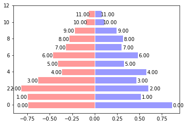

# 横条图plt.barh(高度,X轴)


```python
import matplotlib.pyplot as plt
import matplotlib
import numpy as np
```

### 设置中文字体


```python
matplotlib.rcParams['font.family']='SimHei'
```


```python
n = 12
X = np.arange(n)
Y1 = (1-X/float(n)) * np.random.uniform(0.5,1.0,n)
Y2 = (1-X/float(n)) * np.random.uniform(0.5,1.0,n)

plt.barh(X, +Y1, facecolor='#9999ff', edgecolor='white')
plt.barh(X, -Y2, facecolor='#ff9999', edgecolor='white')
#设置字体的位置
for x,y in zip(Y1,X):
    plt.text(x+0.07, y-0.4, '%.2f' % y, ha='center', va= 'bottom')
for x,y in zip(Y2,X):
    plt.text(-x+(-0.06),y-0.4, "%.2f" % y, ha ='center',va = 'bottom')
```





```python
zz = 1.2
fig, ax = plt.subplots()
ax.barh(X, +Y1,facecolor='#9999ff',edgecolor='white')
ax.barh(X,-Y2,facecolor='#ff9999',edgecolor='white')
#ax.set_xlim(-zz,zz)
ax.set_title('横向条型图')
ax.set_ylabel('barh的第一个参数代表高度')
ax.set_xlabel('bqrh的第二个参数代表X轴坐标')
ax.set_xticks([-1,-0.5,0,0.5,1])
ax.set_xticks([-0.75,-0.25,0.25,0.75],True)
ax.set_xticklabels(['-1','-0.5','0','0.5','1'])
for x,y in zip(Y1,X):
    ax.text(x+0.07, y-0.3, '%.2f' % y, ha='center', va= 'bottom')
for x,y in zip(Y2,X):
    ax.text(-x+(-0.06),y-0.3, "%.2f" % y, ha ='center',va = 'bottom')

#ax.grid()
```


